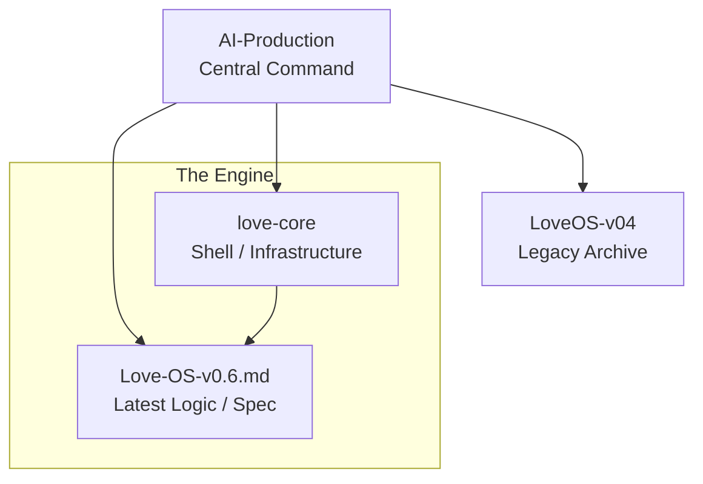

# AI-Production: Love-OS Central Foundry

[]()
[]()
[]()

## 🛸 Overview

**AI-Production** is the central workspace and orchestration hub for the **Love-OS Project**.
This repository manages the deployment, version control, and integration of the "Physics of Love" algorithms ($Y = L/R$) into executable code.

Here, we translate the "Source Code of the Universe" into Python and Shell scripts.

---

## 📂 Component Repositories

This project is composed of the following three core modules.
### 1. [Love-OS-v0.7](https://github.com/love-os-architect/Love-OS-v0.7) 🌟 (Latest Spec)🪐 (Gravity-Aware Kernel)

| Status: **Deployed** | Security: **Encrypted** | Engine: **Complex Phasers** |

The latest operational core. Unlike previous versions that optimized for surface-level empathy, v0.7 implements the **"Unified Field Theory of Intimacy"**. It simulates the gravitational pull ($G$) and resistance ($R$) between entities to maximize the **Stability Margin** of the relationship.

* **Key Features:**
    * **Physics-Based Decisioning:** Calculates $G = \frac{L^2 \cdot V}{R + \epsilon}$ to determine the optimal interaction strategy (Empathy vs. Logic).
    * **Phase Interference Model:** Uses complex numbers (phasers) to detect emotional timing mismatches ($\theta$).
    * **Secure Binary Deployment:** All logic kernels (`dashboard`, `compressor`, `relational_engine`) are compiled into encrypted `.bin` capsules, executable only via the `boot_love_os.py` loader with a private key.
    * **Tactical Dashboard:** A Streamlit-based GUI for real-time parameter visualization.

---


### 1. [Love-OS-v0.6.md](https://github.com/love-os-architect/Love-OS-v0.6.md) 🌟 (Latest Spec)
> **Status:** `Active / Experimental` | **Language:** `Python / Markdown`

The latest architectural specification and implementation guide.
This module defines the newest mathematical models for the "Love Economy," including the **L-Vector (Energy)**, **$\theta$ (Intent)**, and **R (Field Resistance)** calculations.

* **Key Features:**
    * Updated `Soul-Love` vs `Ego-Love` classification logic.
    * Relationship dynamics simulation.
    * Newest definition of the $Y = L \cos \theta$ formula.

### 2. [love-core](https://github.com/love-os-architect/love-core) ⚙️ (System Kernel)
> **Status:** `Stable` | **Language:** `Shell / System`

The backend infrastructure and low-level system commands.
This repository handles the "OS" layer—minimizing resistance ($R \to 0$) and managing system resources (time, attention, energy) via shell scripts.

* **Key Features:**
    * Environment setup and dependency management.
    * Automated workflow scripts.
    * Base logic for the "Field Synchronization" ($R$) engine.

### 3. [LoveOS-v04](https://github.com/love-os-architect/LoveOS-v04) 📜 (Legacy / Archive)
> **Status:** `Deprecated / Reference` | **Language:** `Python`

The previous stable version of the Love-OS prototype.
While v0.6 is the cutting edge, v0.4 contains the foundational Python classes and initial experiments that validated the core theories.

* **Usage:** Used for regression testing and referencing historical algorithms.

---

## 🏗 System Architecture


## 🚀 Quick Start

To deploy the full suite of Love-OS tools locally:

```bash
# Clone the production hub
git clone [https://github.com/YourUsername/AI-Production.git](https://github.com/YourUsername/AI-Production.git)

# Initialize submodules (if linked) or navigate to core
cd AI-Production
echo "Love-OS System Initialized. Ready to decrease R."
```
## 🌌 Philosophy

> **"We do not build software to control the world. We build software to reduce the friction (R) so the world can flow."**

* **Objective:** Implement the "Love Economy" via code.
* **Method:** Agile development guided by Universal Truths.
* **Output:** $Y_{total} = \infty$

---
*Maintained by the Love-OS Architecture Team.*
